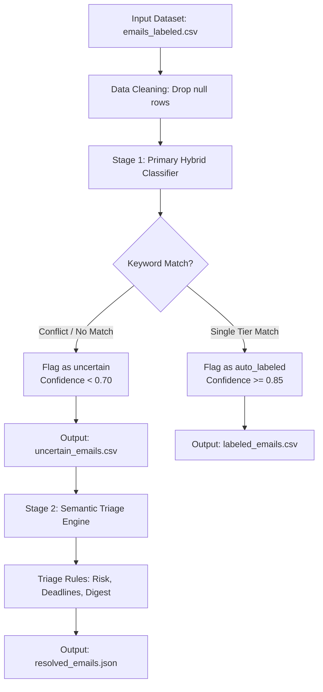

# Unified Desk: Email Mode & Priority Classifier

This repository implements a **two-stage hybrid labeling and triage pipeline** to categorize an unlabeled or partially labeled email dataset. The pipeline classifies emails by **Mode** (work vs. personal) and **Priority** (low, medium, high), automatically handling ambiguities, keyword conflicts, and risk mitigation using cost-sensitive heuristics.

---

## Pipeline Overview

The classifier operates in two consecutive stages to process emails with high precision:



### Stage 1: Primary Hybrid Classification
1. **Data Cleaning**: Drops corrupt or empty rows (identifies 58 completely null rows from the input).
2. **Mode Tagging**: Tags Mode as `work` or `personal` by checking sender domains (known webmail domains vs. enterprise domains) and keyword distributions.
3. **Priority Labeling**: Applies mode-specific keyword rules:
   * **Work Mode Rules**:
     * **HIGH**: `urgent`, `asap`, `critical`, `server down`, `outage`, `security breach`, `executive escalation`
     * **MEDIUM**: `meeting`, `standup`, `review`, `client request`, `status update`, `decision needed`
     * **LOW**: `newsletter`, `digest`, `automated backup`, `routine maintenance`, `fyi`
   * **Personal Mode Rules**:
     * **HIGH**: `emergency`, `hospital`, `accident`, `account frozen`, `fraud`, `urgent family matter`
     * **MEDIUM**: `appointment`, `event invitation`, `invoice`, `payment due`, `follow-up`
     * **LOW**: `newsletter`, `casual check-in`, `promotion`, `booking confirmation`
4. **Flagging & Confidence**:
   * Matches exactly one keyword tier: Flagged as `auto_labeled` (`confidence_score = 0.85`).
   * No matches or conflicting matches across tiers: Flagged as `uncertain` (`confidence_score < 0.70`).

### Stage 2: Semantic Triage Engine
Triages the `uncertain` subset (6,771 emails) using context cues, sender details, and risk factors:
* **Cost-Sensitive Weighting**: False Negatives on HIGH priority are weighted 5× worse than False Positives. Any indicator of outages, security threat, compromised accounts, or emergencies immediately escalates to **HIGH**.
* **Deadline & Urgency**: Hard deadlines or active call-back requirements (e.g. `by eod`, `immediately`) escalate to **HIGH**.
* **Conflict Resolution**: Resolves mixed signals (e.g., newsletters mentioning security breaches vs. pure marketing offers).
* **Fallback Defaults**: Genuinely ambiguous emails are set to **MEDIUM** to ensure visibility without causing notification fatigue.

---

## Repository Structure

* [classify_emails.py](file:///d:/Email%20classifier/classify_emails.py): The Stage 1 primary classification script.
* [triage_emails.py](file:///d:/Email%20classifier/triage_emails.py): The Stage 2 semantic triage engine.
* `emails_labeled.csv`: The raw input email dataset (10,058 rows).
* [labeled_emails.csv](file:///d:/Email%20classifier/labeled_emails.csv): Stage 1 output containing the fully classified dataset (10,000 cleaned rows).
* [uncertain_emails.csv](file:///d:/Email%20classifier/uncertain_emails.csv): Sub-list containing only primary uncertain/conflicting emails.
* [resolved_emails.json](file:///d:/Email%20classifier/resolved_emails.json): Stage 2 output containing triaged results and decision rationales for the uncertain subset.

---

## How to Run

### Prerequisites
* Python 3.x
* `pandas` library

Install dependencies:
```bash
pip install pandas
```

### Step 1: Run Primary Classification
Execute the primary hybrid labeling script to classify modes, apply initial priority keywords, and split out uncertain files:
```bash
python classify_emails.py
```

### Step 2: Run Triage on Uncertain Emails
Resolve ambiguities and keyword conflicts in the uncertain subset:
```bash
python triage_emails.py
```

---

## Pipeline Statistics

On a dataset of 10,000 valid emails:

### Primary Labels (Stage 1)
* **Predicted Mode**: `personal` (5,156 | 51.56%) | `work` (4,844 | 48.44%)
* **Flag Distribution**: `uncertain` (6,771 | 67.71%) | `auto_labeled` (3,229 | 32.29%)

### Resolved Labels (Stage 2 Triage)
* **Resolved Priority**: `medium` (4,856 | 71.72%) | `low` (1,164 | 17.19%) | `high` (751 | 11.09%)
* **Average Confidence**: `high` (0.88) | `low` (0.88) | `medium` (0.73)
